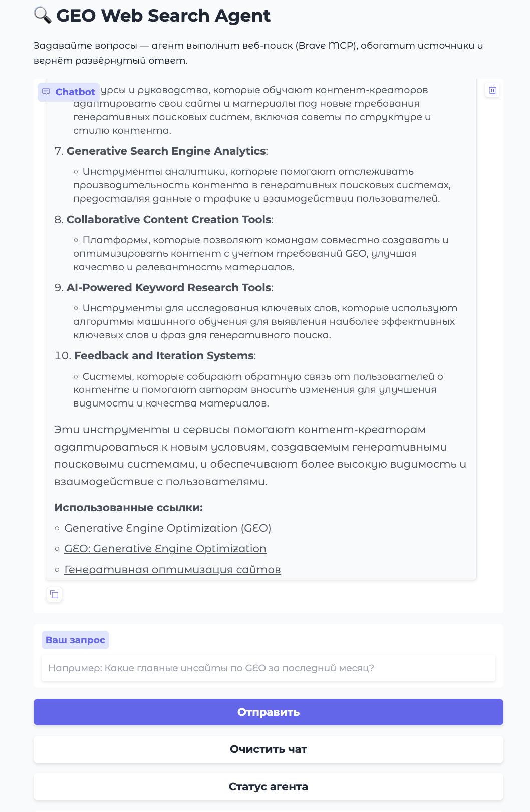
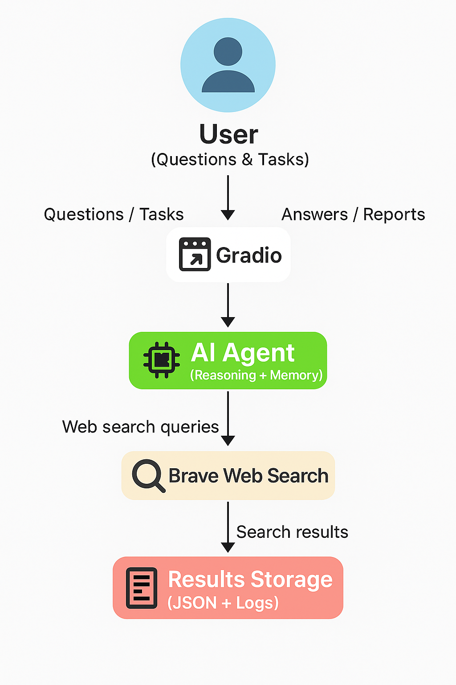

# 🔍 Web Search Agent

AI-агент для веб-поиска и анализа информации с использованием **Brave Search MCP** и обогащения текстов через **Trafilatura**.  
Агент работает в интерактивном интерфейсе [Gradio](https://gradio.app), позволяет задавать вопросы и получать структурированные ответы с источниками.

---

## 🚀 Возможности

- Подключение к нескольким LLM-провайдерам:
  - [Ollama](https://ollama.com/)
  - [OpenAI](https://platform.openai.com/)
  - [OpenRouter](https://openrouter.ai/)
  - [DeepSeek](https://chat.deepseek.com/)
- Асинхронный веб-поиск через Brave MCP.
- Автоматическое обогащение результатов поиска (Trafilatura).
- Сохранение результатов в `results.json` с дедупликацией.
- Удобный веб-интерфейс на Gradio:
  - чат-окно (по умолчанию высота 800px),
  - кнопка очистки истории,
  - кнопка проверки статуса агента.

---

## 🖼 Превью



> Скриншот: пример работы агента через Gradio.

---

## 🗂️ Схема агента



---

## 🛠 Установка

1. Клонируйте репозиторий:
   ```bash
   git clone https://github.com/yourname/web_search_agent.git
   cd web_search_agent
   ```

2. Создайте и активируйте виртуальное окружение:
   ```bash
   python -m venv venv
   source venv/bin/activate   # macOS / Linux
   venv\Scripts\activate      # Windows
   ```

3. Установите зависимости:
   ```bash
   pip install -r requirements.txt
   ```

4. Создайте `.env` файл и добавьте ключи:
   ```env
   BRAVE_API_KEY=ваш_ключ
   OPENAI_API_KEY=ваш_ключ
   OPENROUTER_API_KEY=ваш_ключ
   DEEPSEEK_API_KEY=ваш_ключ
   ```

---

## ▶️ Запуск

```bash
python -m app.agent
```

По умолчанию приложение запускается на порту **7860**:  
👉 [http://localhost:7860](http://localhost:7860)

---

## ⚙️ Конфигурация

Основные настройки находятся в `config/settings.py`:

- `FILESYSTEM_PATH` — директория для работы с файлами через MCP.
- `MODEL_PROVIDER` — какой LLM использовать (`ollama`, `openai`, `openrouter`, `deepseek`).
- `TEMPERATURE`, `ANSWER_MAX_TOKENS` — параметры генерации.

---

## 📂 Структура проекта

```
app/
  ├── agent.py          # Gradio-приложение
  ├── main.py           # Логика FileSystemAgent
  ├── utils/
  │   ├── logging.py    # Логирование (Loguru)
  │   ├── content.py    # Trafilatura
  │   ├── storage.py    # Сохранение результатов поиска
  │   └── tools.py      # Обёртка MCP-инструментов
  └── ...
```

---

## ✅ Пример работы

1. Запустите приложение.
2. Задайте вопрос, например:
   ```
   Какие главные инсайты по GEO за последний месяц?
   ```
3. Агент выполнит поиск, извлечёт описания статей и вернёт структурированный список с источниками.

---

## 📝 TODO

- [ ] Добавить выбор модели в интерфейсе Gradio.
- [ ] Сохранять историю чата в файл.
- [ ] Добавить авторизацию по токену при деплое.

---

## 📜 Лицензия

MIT
